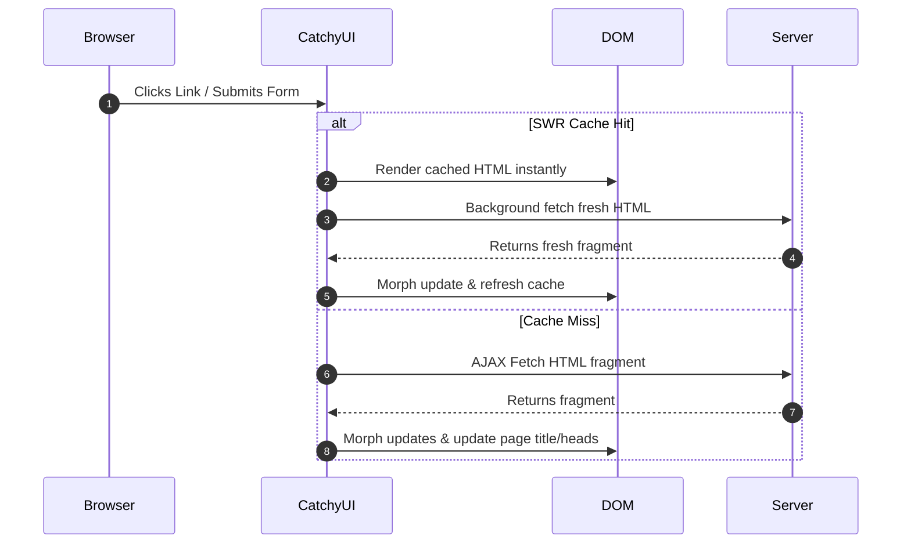

<div align="center">

 <h1>CatchyUI </h1>

 <p><strong>A lightning-fast, headless Single Page Application (SPA) adapter for Laravel.</strong></p>

 <p>
  <a href="https://github.com/hamdyelbatal122/catchy/releases"></a>
  <a href="https://github.com/hamdyelbatal122/catchy/actions/workflows/run-tests.yml"></a>
  
  <a href="LICENSE"></a>
 </p>

 <h4>Convert standard Laravel views into a fluid, zero-refresh SPA using Alpine.js and HTML-over-the-wire.</h4>
</div>

---

## Introduction

**CatchyUI** is a lightweight, zero-dependency SPA engine for Laravel. By utilizing Alpine.js and `@alpinejs/morph`, it intercepts native anchor clicks and form submissions, fetching only the modified HTML fragments and morphing them seamlessly into the active DOM. 

Unlike heavy frontend frameworks, CatchyUI is **100% headless**—it imposes no styling, letting you design premium interfaces while managing transitions, SWR caching, lazy loading, and validation highlights out-of-the-box.



---

## Key Features

* **HTML-over-the-wire**: Only exchange modified page body fragments, saving bandwidth and rendering layouts instantly.
* **Zero Configuration**: Anchors and forms are intercepted automatically. Plug and play with no custom routing scripts.
* **Dynamic SEO & Head Syncing**: Seamlessly merges document titles, meta tags, styles, and script tags during navigation.
* **Stale-While-Revalidate (SWR)**: Instantly render cached pages, fetching updates in the background for zero-wait loads.
* **Lazy Loading (`x-catchy-lazy`)**: Load page sections asynchronously on load or viewport intersection.
* **Live Inputs Syncing (`x-catchy-sync`)**: Bind inputs (e.g. search boxes) to backend routes with debounced live morph updates.
* **Graceful Degradation**: Automatically falls back to standard page visits if server connection fails.

---

## Installation

### 1. Install via Composer
```bash
composer require catchyui/catchy
```

### 2. Run Setup Command
This command publishes configurations, assets, and generates the layout template:
```bash
php artisan catchy:install
```

### 3. Setup Layout File
Include the dynamic toasts `<x-catchy-toasts />` and scripts `<x-catchy-scripts />` components into the master layout file before `</body>`:

```html
<!DOCTYPE html>
<html lang="en">
<head>
  <meta charset="utf-8">
  <meta name="viewport" content="width=device-width, initial-scale=1">
  <meta name="csrf-token" content="{{ csrf_token() }}">
  <title>Laravel SPA</title>
  @vite(['resources/css/app.css', 'resources/js/app.js'])
</head>
<body class="bg-slate-50 text-slate-800">

  <!-- Main SPA Container -->
  <div id="catchy-app">
    @yield('content')
  </div>

  <!-- Dynamic Toast Notification Feed -->
  <x-catchy-toasts />

  <!-- Injects Catchy SPA scripts and configuration -->
  <x-catchy-scripts />
</body>
</html>
```

---

## Blade Components (SPA DX Wrapper)

CatchyUI provides clean, premium wrapper components to handle routes, forms, modals, and toasts seamlessly.

### 1. Navigation Link (`<x-catchy-link>`)
Automatically manages active/inactive classes depending on route matching, matching exact URLs or wildcards.

```html
<x-catchy-link 
  href="/dashboard" 
  active="bg-indigo-50 text-indigo-600 font-bold" 
  inactive="text-slate-600 hover:bg-slate-50" 
  class="flex items-center gap-3 p-3 rounded-xl">
  <span>Dashboard</span>
</x-catchy-link>
```
* **Properties**:
 * `href`: Target URL.
 * `active`: CSS classes applied when active.
 * `inactive`: CSS classes applied when inactive.
 * `exact`: Match exact pathname string only (default: `false`).

### 2. Declarative Form (`<x-catchy-form>`)
Simplifies form submissions with auto-injected CSRF tokens, automatic error clearing, method spoofing, and customizable loaders.

```html
<x-catchy-form 
  action="/posts/create" 
  method="POST" 
  on-success="reset;toast:Post published successfully!"
  on-error="toast:An error occurred.">
  
  <textarea name="content" required></textarea>
  <button type="submit">Submit Post</button>
</x-catchy-form>
```
* **Properties**:
 * `action`: Target submission URL.
 * `method`: HTTP Verb (`GET`, `POST`, `PUT`, `DELETE`, etc.).
 * `on-success`: Shorthand actions to execute on successful submissions (e.g. `reset;toast:msg;reload:lazy-id`).
 * `on-error`: Shorthand actions to execute on failure.
 * `confirm-modal`: Auto-open/close a target modal on validation completion.
 * `no-loader`: Disable the automated inline submit spinner button animation.

### 3. Responsive Modals (`<x-catchy-modal>`)
Dynamic modals that automatically handle view transitions, forms, and triggers.

```html
<!-- Trigger link -->
<a href="/user/profile" catchy-modal="profile-modal">View Profile</a>

<!-- Modal component -->
<x-catchy-modal id="profile-modal" title="User Profile">
  <!-- Target container will load and morph inside here -->
</x-catchy-modal>
```

---

## Directives & Interceptors

### 1. Lazy Loading (`x-catchy-lazy`)
Load elements asynchronously when the container scrolls into view or during initial page render:
```html
<!-- Load immediately -->
<div x-catchy-lazy="/comments">Loading comments...</div>

<!-- Load when scrolled into viewport -->
<div x-catchy-lazy.intersect="/recommended-products">Loading recommendations...</div>
```
To reload a lazy block programmatically:
```javascript
window.dispatchEvent(new CustomEvent('catchy:lazy-reload', { detail: { id: 'comments' } }));
```

### 2. Live Syncing (`x-catchy-sync`)
Intercepts input changes/keystrokes and syncs/morphs the page target with the backend:
```html
<input type="text" name="query" 
  x-catchy-sync.input.debounce.300ms.target.results-box="/search" 
  placeholder="Search...">

<div id="results-box">
  <!-- Search list morphs here -->
</div>
```

---

## Asset Overrides & Customization

CatchyUI has 100% decoupled frontend assets, meaning you can fully customize visual elements and animations:

### Stylesheets Customization
If published, transition and modal styles are fully separate:
* `resources/css/transitions.css`: Handles slide, fade, scale transitions.
* `resources/css/modal.css`: backdrop blur, top borders, responsive sizing.

### Custom SVG Components
All core SVGs are isolated in Blade files under `resources/views/svg/` to allow full customization:
* `close.blade.php`: Close button for modal overlays & toasts.
* `spinner.blade.php`: Button submit loader animation.

---

## License

The MIT License (MIT). Please see [License File](LICENSE) for more details.
