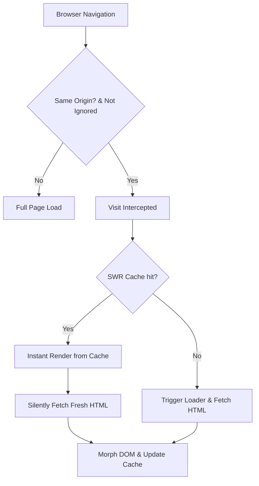

# Catchy ⚡

Laravel Catchy converts standard Laravel applications into high-performance, seamless SPAs using Alpine.js and `@alpinejs/morph`. By removing styling opinions and visual elements, Catchy is a **100% headless** engine. You get absolute styling freedom while Catchy manages instant page transitions, form interceptions, SWR caching, and dynamic head/meta updates in the background.



---

## Key Features

- **HTML-over-the-wire**: Only modified page body fragments are exchanged, saving bandwidth and rendering instantly.
- **Zero-Configuration**: Standard links and forms are intercepted automatically. Plug and play out-of-the-box.
- **Dynamic SEO/Head Merging**: Seamlessly synchronizes page titles, meta tags, styles, and scripts on navigation.
- **Stale-While-Revalidate (SWR)**: Instantly renders cached pages and updates them in the background.
- **Headless Lazy Loading (`x-catchy-lazy`)**: Load sections asynchronously on page load or viewport intersection.
- **Two-way Syncing (`x-catchy-sync`)**: Sync inputs (such as search boxes) with the backend in real-time.
- **Graceful Degradation**: Fallbacks to standard browser requests if the connection is lost.
- **Decoupled Assets**: Fully separate CSS files and SVG icons for total layout customizability.

---

## Installation & Setup

### 1. Install Package
```bash
composer require hamzi/catchy
```

### 2. Run Installation Command
This command publishes configuration files, assets, and generates an optional layouts file:
```bash
php artisan catchy:install
```

### 3. Setup Layout
Include the `<x-catchy-toasts />` and `<x-catchy-scripts />` Blade components inside the master layout (before `</body>`):
```html
<!DOCTYPE html>
<html>
<head>
    <title>My Laravel App</title>
    @vite(['resources/css/app.css', 'resources/js/app.js'])
</head>
<body class="bg-slate-50">

    <!-- Main SPA Container -->
    <div id="catchy-app">
        @yield('content')
    </div>

    <!-- Drop-in Toast Notifications -->
    <x-catchy-toasts />

    <!-- Injects Catchy SPA scripts and configuration -->
    <x-catchy-scripts />
</body>
</html>
```

---

## 📦 DX Blade Components

Catchy includes zero-overhead Blade components to simplify routing, forms, notifications, and modals.

### 1. Catchy Link (`<x-catchy-link>`)
Automatically handles active class matching with exact or wildcard patterns, custom transitions, and navigation behavior.

```html
<x-catchy-link 
    href="/dashboard"
    active="bg-indigo-100 text-indigo-700 font-semibold"
    inactive="text-slate-600 hover:bg-slate-50"
    class="flex items-center gap-2 p-3 rounded-xl">
    Dashboard
</x-catchy-link>
```
* **Props**:
  * `href`: Target URL path.
  * `active`: Tailwind/CSS classes applied when the current path matches `href`.
  * `inactive`: CSS classes applied when the path does not match.
  * `exact`: Boolean (default `false`). If true, matches path strictly.

### 2. Catchy Form (`<x-catchy-form>`)
Simplifies form submissions by automatically injecting CSRF tokens, handling method spoofing, integrating spinners, and routing dynamically.

```html
<x-catchy-form 
    action="/posts" 
    method="POST" 
    on-success="reset;toast:Post published successfully!"
    on-error="toast:An error occurred while saving."
    class="space-y-4">
    
    <textarea name="content" required></textarea>
    <button type="submit">Publish</button>
</x-catchy-form>
```
* **Props**:
  * `action`: Target submission URL.
  * `method`: HTTP Verb (POST, GET, PUT, DELETE, etc.).
  * `on-success`: Shorthand actions to execute on successful submission (e.g. `reset;toast:message;reload:lazy-id`).
  * `on-error`: Shorthand actions on failure.
  * `confirm-modal`: Close or open a target modal on validation completion.
  * `no-loader`: Disable the automated inline submit spinner.

### 3. Catchy Modals (`<x-catchy-modal>`)
Dynamic responsive modals that listen to page transitions, forms, and triggers.

```html
<!-- Trigger link -->
<a href="/user/profile" catchy-modal="profile-modal">View Profile</a>

<!-- Modal structure -->
<x-catchy-modal id="profile-modal" title="User Profile">
    <!-- content will morph inside here -->
</x-catchy-modal>
```

---

## ⚡ Directives & Core Interceptors

### 1. Lazy Loading (`x-catchy-lazy`)
Load elements asynchronously when the page loads or when the container scrolls into view:
```html
<!-- Load immediately -->
<div x-catchy-lazy="/comments">Loading comments...</div>

<!-- Load when scrolled into view -->
<div x-catchy-lazy.intersect="/recommended-products">Loading recommendations...</div>
```
Reload programmatically:
```javascript
window.dispatchEvent(new CustomEvent('catchy:lazy-reload', { detail: { id: 'comments' } }));
```

### 2. Live Syncing (`x-catchy-sync`)
Intercepts input changes/keystrokes and syncs/morphs the page target with the backend:
```html
<input type="text" name="query" 
    x-catchy-sync.input.debounce.300ms.target.results-box="/search" 
    placeholder="Search...">

<div id="results-box">
    <!-- Search list morphs here -->
</div>
```

---

## 🎨 Asset Customization & Overrides

Catchy assets are fully decoupled, making customization painless:

### CSS Customization
Publish views and customize styles directly:
```bash
php artisan vendor:publish --tag=catchy-views
```
The transitions styles are located under:
* `resources/css/transitions.css`: Handle slide, fade, scale transitions.
* `resources/css/modal.css`: Centered backdrop, headers, borders, animations.

### Custom SVG Icons
All system SVGs are housed as individual Blade views. You can override them directly:
* `resources/views/svg/close.blade.php`: Close button for modal overlays & toasts.
* `resources/views/svg/spinner.blade.php`: Submit loader animation.

---

## License

The MIT License (MIT). Please see [License File](LICENSE) for more details.
